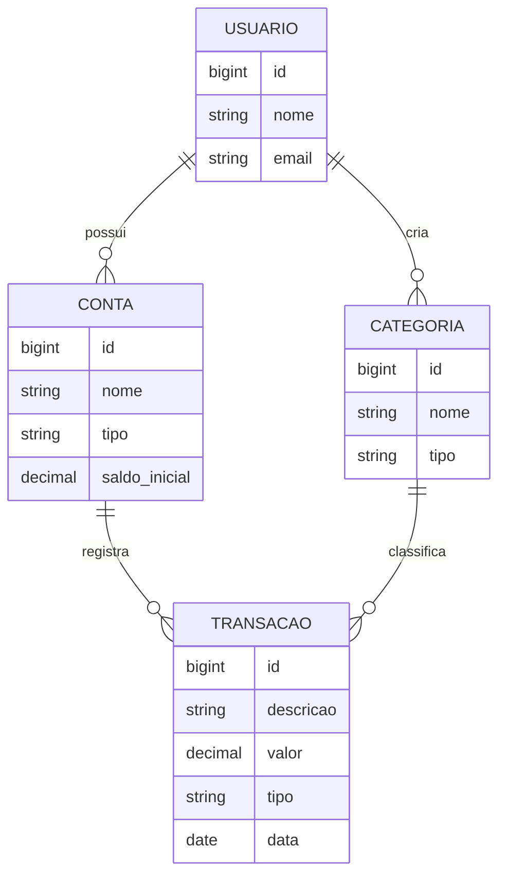

# 💰 Finanças API


API REST de finanças pessoais para controlar contas, categorias, receitas e despesas, com relatórios mensais.

## 🌐 Demo online
- **Swagger:** https://financas-api-cp5q.onrender.com/swagger-ui.html
- **Login demo:** `demo@financas.local` / `demo1234` (já tem contas, transações e relatório preenchidos)

> ⏳ Hospedado no plano gratuito: depois de um tempo sem acesso, a primeira requisição pode levar cerca de 1 minuto para "acordar" a API.

## 🛠️ Stack
- **Java 17** + **Spring Boot 3**
- **Spring Security** + **JWT** (OAuth2 Resource Server / Nimbus) + **BCrypt**
- **Spring Data JPA** + **PostgreSQL 16**
- **Flyway** para versionar o schema
- **springdoc-openapi** (Swagger UI)
- **JUnit 5** + **Testcontainers** (testes contra um Postgres real)
- **Docker** / **Docker Compose**
- **GitHub Actions** (CI) + **JaCoCo** (cobertura)

## 🚀 Como rodar

Pré-requisitos: Java 17, Maven e Docker.

```bash
# 1. Sobe o Postgres
docker compose up -d

# 2. Sobe a API
mvn spring-boot:run
```

Ou tudo em container:

```bash
docker compose --profile app up --build
```

- API: http://localhost:8080
- Swagger: http://localhost:8080/swagger-ui.html
- Health: http://localhost:8080/actuator/health

### 🔐 Autenticação
Todas as rotas, exceto cadastro e login, exigem um token JWT.

1. Faça login em `POST /api/auth/login` com o **usuário demo**: `demo@financas.local` / `demo1234` (ou crie o seu em `POST /api/auth/cadastro`).
2. Copie o `token` da resposta.
3. No Swagger, clique em **Authorize** e cole o token. Em outras ferramentas, envie o header `Authorization: Bearer <token>`.

O token expira em 1 hora. Em produção, defina a variável `JWT_SECRET` (mínimo de 32 caracteres).

### Testes
```bash
mvn verify
```
O Docker precisa estar rodando: o Testcontainers sobe um Postgres temporário para os testes.
Relatório de cobertura: `target/site/jacoco/index.html`.

## ☁️ Deploy

```
git push → GitHub Actions (testes) → Render (build do Dockerfile) → API no ar
                                             │
                                             └── PostgreSQL no Neon
```

- **[Render](https://render.com)** roda a API a partir do `Dockerfile`, com a configuração versionada em [`render.yaml`](render.yaml).
- **[Neon](https://neon.tech)** hospeda o PostgreSQL.
- Perfil **`prod`** ([`application-prod.yml`](src/main/resources/application-prod.yml)): pool de conexões reduzido e **dados de exemplo** para o usuário demo (`db/demo`), que nunca são carregados nos testes.
- A JVM é ajustada para caber em 512 MB (`JAVA_TOOL_OPTIONS` no Dockerfile).
- Segredos (`DB_URL`, `DB_USER`, `DB_PASSWORD`, `JWT_SECRET`) ficam só nas variáveis de ambiente da plataforma.

## 🗂️ Modelo de dados



## 📁 Estrutura

O código é organizado **por funcionalidade**, não por camada:

```
src/main/java/br/com/financas
├── auth/               # cadastro, login e geração do token JWT
├── usuario/            # entidade e repository de usuário
├── categoria/          # controller, service, repository, entidade e DTOs
├── conta/              # mesmo padrão de categoria
├── transacao/          # liga conta e categoria; filtros (Specifications) e exportação CSV
├── relatorio/          # relatório mensal com somas agrupadas no banco
├── config/             # segurança (JWT, BCrypt, 401 em JSON) e OpenAPI
└── shared/
    ├── exception/      # exceções e handler global (RFC 7807)
    └── usuario/        # UsuarioLogado: lê o id do usuário a partir do token
```

## 📡 Endpoints

| Método | Rota | Descrição |
|---|---|---|
| POST | `/api/auth/cadastro` | Cria um usuário (público) |
| POST | `/api/auth/login` | Devolve o token JWT (público) |
| GET | `/api/auth/me` | Dados do usuário autenticado |
| GET | `/api/categorias?tipo=&page=&size=` | Lista as categorias globais + as do usuário (paginado) |
| GET | `/api/categorias/{id}` | Busca uma categoria |
| POST | `/api/categorias` | Cria uma categoria |
| PUT | `/api/categorias/{id}` | Atualiza uma categoria própria |
| DELETE | `/api/categorias/{id}` | Exclui uma categoria própria |
| GET | `/api/contas?tipo=&page=&size=` | Lista as contas do usuário (paginado) |
| GET | `/api/contas/{id}` | Busca uma conta |
| POST | `/api/contas` | Cria uma conta |
| PUT | `/api/contas/{id}` | Atualiza uma conta |
| DELETE | `/api/contas/{id}` | Exclui uma conta (bloqueado se houver transações) |
| GET | `/api/transacoes?inicio=&fim=&contaId=&categoriaId=&tipo=&descricao=` | Lista as transações com filtros opcionais (mais recentes primeiro) |
| GET | `/api/transacoes/exportar?...` | Exporta em CSV, com os mesmos filtros |
| GET | `/api/transacoes/{id}` | Busca uma transação |
| POST | `/api/transacoes` | Registra uma receita ou despesa |
| PUT | `/api/transacoes/{id}` | Atualiza uma transação |
| DELETE | `/api/transacoes/{id}` | Exclui uma transação |
| GET | `/api/relatorios/mensal?ano=&mes=&contaId=` | Receitas, despesas e totais por categoria do mês |

### Relatório mensal
```json
{
  "periodo": "2026-10",
  "totalReceitas": 5800.00,
  "totalDespesas": 1880.00,
  "saldoDoMes": 3920.00,
  "contas": [
    { "id": 4, "nome": "Carteira", "receitas":    0.00, "despesas":   80.00, "saldoDoMes":  -80.00 },
    { "id": 3, "nome": "Nubank",   "receitas": 5800.00, "despesas": 1800.00, "saldoDoMes": 4000.00 }
  ],
  "despesasPorCategoria": [
    { "categoriaId": 4, "categoria": "Moradia", "total": 1500.00, "percentual": 79.79,
      "contas": [ { "id": 3, "nome": "Nubank", "total": 1500.00 } ] },
    { "categoriaId": 5, "categoria": "Alimentação", "total": 380.00, "percentual": 20.21,
      "contas": [ { "id": 3, "nome": "Nubank", "total": 300.00 }, { "id": 4, "nome": "Carteira", "total": 80.00 } ] }
  ],
  "receitasPorCategoria": [ "..." ]
}
```
- `contas`: resumo de cada conta que teve movimentação no mês (ou só a conta filtrada, com `contaId`).
- Em cada categoria, `contas` mostra de qual conta saiu (ou entrou) o valor.
Sem `ano` e `mes`, usa o mês atual. O percentual é a participação dentro do mesmo tipo.

### Exportação CSV
Abre direto no Excel em português: separador `;`, vírgula decimal, data `dd/MM/yyyy` e UTF-8 com BOM. As despesas saem com valor negativo, para a coluna poder ser somada. Limite de 10.000 linhas por exportação.

### Regras de negócio
- O **tipo da transação** precisa ser igual ao da categoria (uma despesa não entra em "Salário").
- O **valor é sempre positivo**: o tipo define se soma ou subtrai.
- **Saldo atual** da conta = saldo inicial + receitas − despesas.
- Conta e categoria **com transações** não podem ser excluídas, e a categoria também não pode mudar de tipo.
- Cada usuário vê **somente os próprios dados**. As **categorias padrão** (globais) são visíveis para todos, mas somente leitura (403).
- Nome de categoria não pode repetir entre as do usuário nem com as globais.

A collection do Postman está em [`postman/`](postman/financas-api.postman_collection.json).

### Formato de erro
Todos os erros seguem o padrão [RFC 7807](https://www.rfc-editor.org/rfc/rfc7807):
```json
{
  "type": "about:blank",
  "title": "Erro de validação",
  "status": 400,
  "detail": "Um ou mais campos são inválidos",
  "campos": { "nome": "é obrigatório" }
}
```

## 🧠 Decisões técnicas
- **Pacotes por funcionalidade**: cada parte do domínio fica isolada e fácil de encontrar.
- **Flyway + `ddl-auto: validate`**: o schema é versionado, e o Hibernate apenas confere se as entidades batem com ele.
- **Testcontainers em vez de H2**: os testes rodam no mesmo banco da produção.
- **Records para DTOs**: imutáveis e sem código repetitivo.
- **Categorias globais** (`usuario_id` nulo) + categorias próprias do usuário.
- **`UsuarioLogado` isolado**: é o único ponto que lê o token. Na troca do usuário fixo para o JWT, nenhum service de Conta ou Transação precisou mudar.
- **JWT com o suporte nativo do Spring** (OAuth2 Resource Server + Nimbus), sem biblioteca de terceiros. O `subject` do token é o id do usuário.
- **Senha com BCrypt**, e login inválido devolve sempre a mesma mensagem genérica, sem revelar se o e-mail existe.
- **API stateless**: sem sessão nem cookie, por isso o CSRF fica desativado.
- **Conta de outro usuário responde 404** (e não 403), para não revelar que o recurso existe.
- **Sem N+1**: a listagem de transações carrega conta e categoria na mesma consulta (`@EntityGraph`), e o saldo de todas as contas da página sai de uma única consulta agrupada.
- **Saldo calculado, não armazenado**: não existe uma coluna de saldo que possa ficar desatualizada; o valor vem sempre da soma das transações.
- **Filtros com JPA Specifications**: o `WHERE` é montado só com os filtros informados, em vez de um método no repository para cada combinação. O filtro do usuário está sempre presente, e `%` e `_` digitados na busca são escapados.
- **Relatório agregado no banco** (`GROUP BY` + `SUM`): uma consulta só, independente do volume de transações.
- **`Clock` injetável**: o "mês atual" vem de um bean, e não direto do relógio do sistema.

## 🗺️ Roadmap
- [x] Estrutura, Docker, Flyway, Swagger, CI
- [x] CRUD de categorias
- [x] CRUD de contas
- [x] CRUD de transações e saldo atual das contas
- [x] Autenticação JWT e isolamento por usuário
- [x] Filtros e relatório mensal
- [x] Exportação CSV
- [x] Deploy (Render + Neon)
