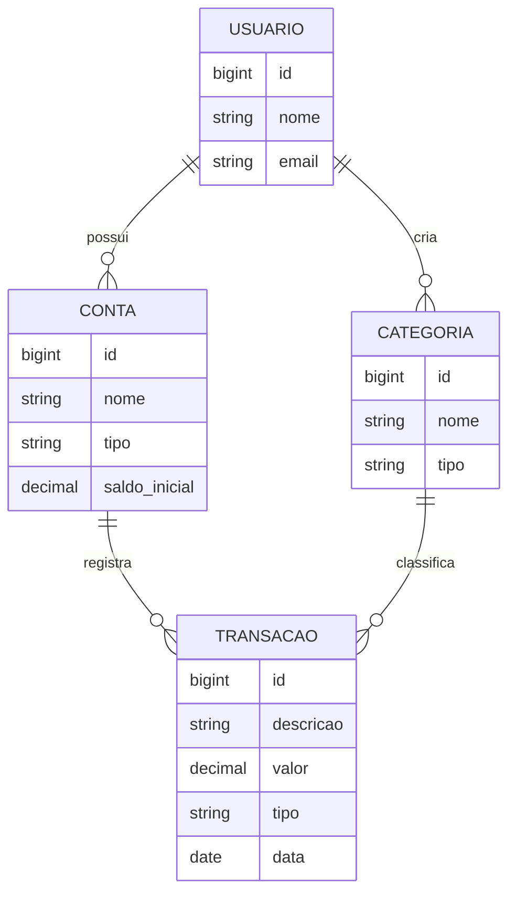

# 💰 Finanças API


API REST de finanças pessoais para controlar contas, categorias, receitas e despesas, com relatórios mensais.

> 🚧 Em desenvolvimento. Veja o [roadmap](#-roadmap).

## 🛠️ Stack
- **Java 17** + **Spring Boot 3**
- **Spring Data JPA** + **PostgreSQL 16**
- **Flyway** para versionar o schema
- **springdoc-openapi** (Swagger UI)
- **JUnit 5** + **Testcontainers** (testes contra um Postgres real)
- **Docker** / **Docker Compose**
- **GitHub Actions** (CI) + **JaCoCo** (cobertura)

## 🚀 Como rodar

Pré-requisitos: Java 17, Maven e Docker.

```bash
# 1. Sobe o Postgres
docker compose up -d

# 2. Sobe a API
mvn spring-boot:run
```

Ou tudo em container:

```bash
docker compose --profile app up --build
```

- API: http://localhost:8080
- Swagger: http://localhost:8080/swagger-ui.html
- Health: http://localhost:8080/actuator/health

### Testes
```bash
mvn verify
```
O Docker precisa estar rodando: o Testcontainers sobe um Postgres temporário para os testes.
Relatório de cobertura: `target/site/jacoco/index.html`.

## 🗂️ Modelo de dados



## 📁 Estrutura

O código é organizado **por funcionalidade**, não por camada:

```
src/main/java/br/com/financas
├── categoria/          # controller, service, repository, entidade e DTOs
├── conta/              # mesmo padrão de categoria
├── transacao/          # liga conta e categoria; consultas de saldo
├── config/             # configurações (OpenAPI)
└── shared/
    ├── exception/      # exceções e handler global (RFC 7807)
    └── usuario/        # UsuarioLogado: único ponto que sabe quem é o usuário
```

## 📡 Endpoints

| Método | Rota | Descrição |
|---|---|---|
| GET | `/api/categorias?tipo=&page=&size=` | Lista categorias (paginado) |
| GET | `/api/categorias/{id}` | Busca uma categoria |
| POST | `/api/categorias` | Cria uma categoria |
| PUT | `/api/categorias/{id}` | Atualiza uma categoria |
| DELETE | `/api/categorias/{id}` | Exclui uma categoria |
| GET | `/api/contas?tipo=&page=&size=` | Lista as contas do usuário (paginado) |
| GET | `/api/contas/{id}` | Busca uma conta |
| POST | `/api/contas` | Cria uma conta |
| PUT | `/api/contas/{id}` | Atualiza uma conta |
| DELETE | `/api/contas/{id}` | Exclui uma conta (bloqueado se houver transações) |
| GET | `/api/transacoes?page=&size=` | Lista as transações (mais recentes primeiro) |
| GET | `/api/transacoes/{id}` | Busca uma transação |
| POST | `/api/transacoes` | Registra uma receita ou despesa |
| PUT | `/api/transacoes/{id}` | Atualiza uma transação |
| DELETE | `/api/transacoes/{id}` | Exclui uma transação |

### Regras de negócio
- O **tipo da transação** precisa ser igual ao da categoria (uma despesa não entra em "Salário").
- O **valor é sempre positivo**: o tipo define se soma ou subtrai.
- **Saldo atual** da conta = saldo inicial + receitas − despesas.
- Conta e categoria **com transações** não podem ser excluídas, e a categoria também não pode mudar de tipo.

> Enquanto a autenticação não existe, todas as requisições usam um **usuário de demonstração** (id 1, criado na migration V3).

A collection do Postman está em [`postman/`](postman/financas-api.postman_collection.json).

### Formato de erro
Todos os erros seguem o padrão [RFC 7807](https://www.rfc-editor.org/rfc/rfc7807):
```json
{
  "type": "about:blank",
  "title": "Erro de validação",
  "status": 400,
  "detail": "Um ou mais campos são inválidos",
  "campos": { "nome": "é obrigatório" }
}
```

## 🧠 Decisões técnicas
- **Pacotes por funcionalidade**: cada parte do domínio fica isolada e fácil de encontrar.
- **Flyway + `ddl-auto: validate`**: o schema é versionado, e o Hibernate apenas confere se as entidades batem com ele.
- **Testcontainers em vez de H2**: os testes rodam no mesmo banco da produção.
- **Records para DTOs**: imutáveis e sem código repetitivo.
- **Categorias globais** (`usuario_id` nulo) + categorias próprias do usuário.
- **`UsuarioLogado` isolado**: hoje devolve o usuário de demonstração. Com o JWT, só essa classe muda.
- **Conta de outro usuário responde 404** (e não 403), para não revelar que o recurso existe.
- **Sem N+1**: a listagem de transações carrega conta e categoria na mesma consulta (`@EntityGraph`), e o saldo de todas as contas da página sai de uma única consulta agrupada.
- **Saldo calculado, não armazenado**: não existe uma coluna de saldo que possa ficar desatualizada; o valor vem sempre da soma das transações.

## 🗺️ Roadmap
- [x] Estrutura, Docker, Flyway, Swagger, CI
- [x] CRUD de categorias
- [x] CRUD de contas
- [x] CRUD de transações e saldo atual das contas
- [ ] Autenticação JWT e isolamento por usuário
- [ ] Filtros e relatório mensal
- [ ] Exportação CSV
- [ ] Deploy
